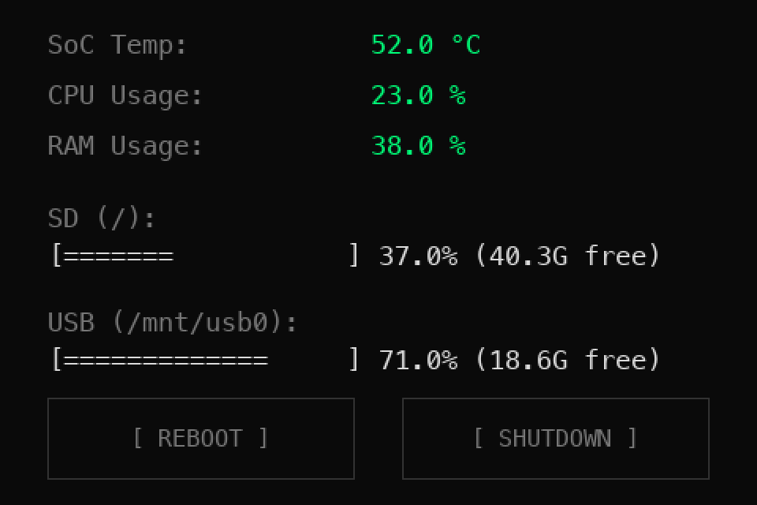

# raspi-monitor

Ultra-lightweight, terminal-style system monitor for a Raspberry Pi with a 3.5" SPI TFT (480x320) and resistive touchscreen. Runs in Docker, writes straight to the Linux framebuffer: no X11, no Wayland.



*Rendered with fake data using the [demo](demo/README.md).*

## Features

- SoC temperature, CPU and RAM usage, colour-coded by threshold (green / amber / red)
- SD card and external USB disk usage, with ASCII progress bars
- Touch buttons **REBOOT** / **SHUTDOWN** with two-step confirmation (4 s timeout)
- Host reboot/poweroff through the systemd D-Bus socket
- Clean exit on `SIGTERM`/`SIGINT`: clears the framebuffer and restores the console cursor
- Configurable touch calibration (swap / invert axes)

## Requirements

- Raspberry Pi with a framebuffer-driven TFT (e.g. `/dev/fb1`) and an ADS7846/XPT2046 touch controller
- Docker and Docker Compose

## Quick start

```bash
git clone git@github.com:krupupakku/raspi-monitor.git
cd raspi-monitor
cat /proc/bus/input/devices   # find your touch device (eventX)
docker compose up -d --build
```

Stop / start the monitor at any time:

```bash
docker compose stop
docker compose start
```

## Configuration

Set in [docker-compose.yml](docker-compose.yml):

| Variable | Default | Description |
|---|---|---|
| `FRAMEBUFFER_DEV` | `/dev/fb0` | Framebuffer to draw on |
| `TOUCH_DEVICE` | `/dev/input/event0` | Touchscreen evdev node |
| `TOUCH_SWAP_XY` | `1` | Swap X/Y axes |
| `TOUCH_INVERT_X` | `1` | Invert X axis |
| `TOUCH_INVERT_Y` | `1` | Invert Y axis |

Defaults are tested and calibrated for 3.5" HDMI TFT displays with XPT2046/ADS7846 touch (e.g. Kuman 3.5" HDMI Display-B v1.2, Waveshare 3.5" HDMI LCD). Adjust touch variables if your display uses a different digitizer orientation.

## Try the UI without a Raspberry Pi

The [demo](demo/README.md) folder renders the interface on your computer with fake data (PNG or interactive window). It is optional and can be deleted without affecting the app.

## Security notes

The container mounts the host root filesystem (read-only) and the systemd D-Bus socket, so it can reboot or power off the host. Only run it on a device you control, and do not expose it to untrusted networks.

## Roadmap

- Jellyfin / Navidrome health indicators
- Local IP and network status

## License

[MIT](LICENSE)
